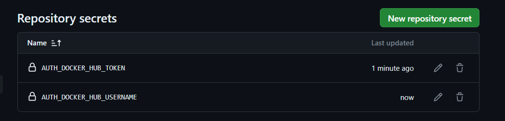
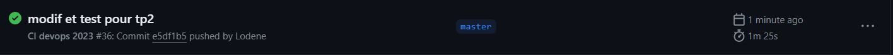
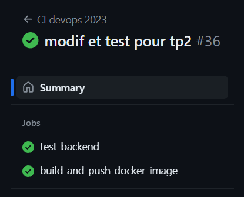
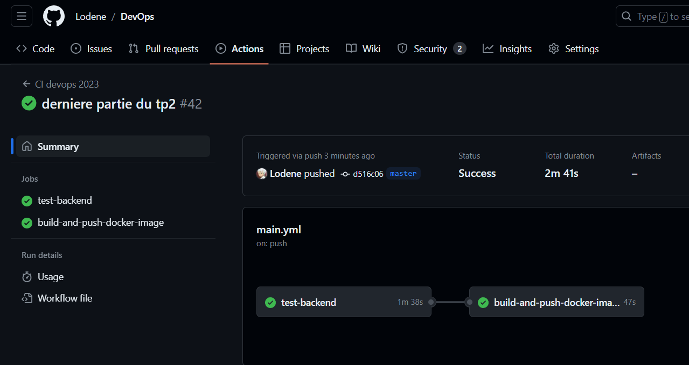
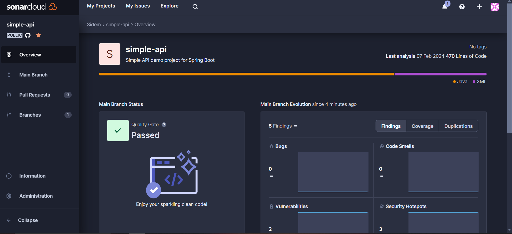

2-1 Que sont les conteneurs de test ?
    bibliotheque java qui execute des conteneurs DOCKER pendant les tests


2-2 Documentez vos configurations d'actions Github.
    fait 


#Premiers pas dans le monde du CD
Je vais placer mes identifiants docker hub dans les variables d'environnement de mon projet github.



Je complete ensuite le fichier .github/workflows/main.yml en completment le fichier. 

plus qu'a push et tester si mes tests fonctionne :




#Setup Quality Gate
Il faut juste créer son compte sonar, suivre les instruction et modifier le main.yml pour ajouter des lignes dont    :
```shell
 - name: Run the Maven verify phase
        run: mvn -B verify sonar:sonar -Dsonar.projectKey=Lodene_DevOps -Dsonar.organization=lodene -Dsonar.host.url=https://sonarcloud.io -Dsonar.login=${{ secrets.SONAR_TOKEN }}  --file ./simple-api-student/pom.xml
```
sur ces lignes j'ai du récupérer les infos donné par sonnar pour compléter la commande donné par le tp
et c'est bon !

