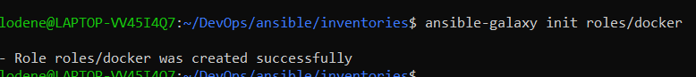
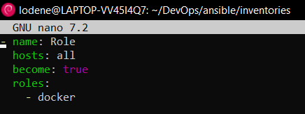
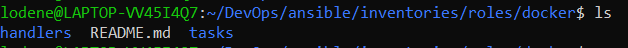
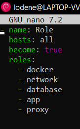
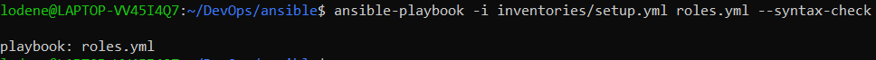
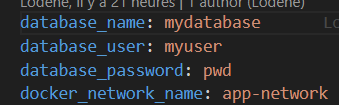

j'ai crée un fichier contenant :
```shell
    all:
        vars:
            ansible_user: centos
            ansible_ssh_private_key_file: ./../../../.ssh/ssh_key
        children:
            prod:
                hosts: antoine.adjamidis.takima.cloud
```

j'ai précisé ici l'utilisateur (centos), où trouver le clé ssh ./../../../.ssh/ssh_key. Pour terminé je précise l'host que vous nous avez envoyé par mail.

on peut voir ensuite que la commande : 
```shell 
ansible all -i inventories/setup.yml -m ping
``` 
cela fonctionne :
```shell
    antoine.adjamidis.takima.cloud | SUCCESS => {
        "ansible_facts": {
            "discovered_interpreter_python": "/usr/bin/python"
        },
        "changed": false,
        "ping": "pong"
    }
```

je recois la réponse "pong"

Ensuite, pour recevoir la distribution de votre OS, je dois faire cette commande :
```shell
    ansible all -i setup.yml -m setup -a "filter=ansible_distribution*"
```
qui me return :
```shell
    antoine.adjamidis.takima.cloud | SUCCESS => {
        "ansible_facts": {
            "ansible_distribution": "CentOS",
            "ansible_distribution_file_parsed": true,
            "ansible_distribution_file_path": "/etc/redhat-release",
            "ansible_distribution_file_variety": "RedHat",
            "ansible_distribution_major_version": "7",
            "ansible_distribution_release": "Core",
            "ansible_distribution_version": "7.9",
            "discovered_interpreter_python": "/usr/bin/python"
        },
        "changed": false
    }
```

On nous demande ensuite de supprimer le server apache crée lors du td :
```shell
    ansible all -i setup.yml -m yum -a "name=httpd state=absent" --become
```
Avec comme réponse :
```shell
    antoine.adjamidis.takima.cloud | CHANGED => {
    "ansible_facts": {
        "discovered_interpreter_python": "/usr/bin/python"
    },
    "changed": true,
    "changes": {
        "removed": [
            "httpd"
        ]
    },
    "msg": "",
    "rc": 0,
    "results": [
        "Loaded plugins: fastestmirror\nResolving Dependencies\n--> Running transaction check\n---> Package httpd.x86_64 0:2.4.6-99.el7.centos.1 will be erased\n--> Finished Dependency Resolution\n\nDependencies Resolved\n\n================================================================================\n Package      Arch          Version                       Repository       Size\n================================================================================\nRemoving:\n httpd        x86_64        2.4.6-99.el7.centos.1         @updates        9.4 M\n\nTransaction Summary\n================================================================================\nRemove  1 Package\n\nInstalled size: 9.4 M\nDownloading packages:\nRunning transaction check\nRunning transaction test\nTransaction test succeeded\nRunning transaction\n  Erasing    : httpd-2.4.6-99.el7.centos.1.x86_64                           1/1 \n  Verifying  : httpd-2.4.6-99.el7.centos.1.x86_64                           1/1 \n\nRemoved:\n  httpd.x86_64 0:2.4.6-99.el7.centos.1                                          \n\nComplete!\n"
    ]
    }
```

Pour valider si cela a bien fonctionner (autrement qu'en regardant la réponse), on peut executer une deuxieme fois la commande, ce qui nous donnera comme réponse :
```shell
    antoine.adjamidis.takima.cloud | SUCCESS => {
        "ansible_facts": {
            "discovered_interpreter_python": "/usr/bin/python"
        },
        "changed": false,
        "msg": "",
        "rc": 0,
        "results": [
            "httpd is not installed" <---- aucun server trouvé
        ]
    }
```

Je crée un fichier playbook.yml dans le meme repertoire que setup.yml en copiant collant l'énoncé du tp.
Ensuite j'entre la commande :
```shell
    ansible-playbook -i setup.yml playbook.yml
```
qui me donne comme résultat :
```shell
    PLAY [all] *************************************************************************************************************

    TASK [Test connection] *************************************************************************************************
    ok: [antoine.adjamidis.takima.cloud]

    PLAY RECAP *************************************************************************************************************
    antoine.adjamidis.takima.cloud : ok=1    changed=0    unreachable=0    failed=0    skipped=0    rescued=0    ignored=0  
```

Pour installer docker, il nous faut un nouveau playbook que j'ai nommé docker.yml avec comme contenu ce qu'il y avait dans le tp, sans rien modifier. Exécutons le :
```shell
lodene@LAPTOP-VV45I4Q7:~/DevOps/ansible/inventories$ ansible-playbook -i setup.yml docker.yml

PLAY [all] *************************************************************************************************************

TASK [Install device-mapper-persistent-data] ***************************************************************************
changed: [antoine.adjamidis.takima.cloud]

TASK [Install lvm2] ****************************************************************************************************
changed: [antoine.adjamidis.takima.cloud]

TASK [add repo docker] *************************************************************************************************
changed: [antoine.adjamidis.takima.cloud]

TASK [Install Docker] **************************************************************************************************
changed: [antoine.adjamidis.takima.cloud]

TASK [Install python3] *************************************************************************************************
changed: [antoine.adjamidis.takima.cloud]

TASK [Install docker with Python 3] ************************************************************************************
changed: [antoine.adjamidis.takima.cloud]

TASK [Make sure Docker is running] *************************************************************************************
changed: [antoine.adjamidis.takima.cloud]

PLAY RECAP *************************************************************************************************************
antoine.adjamidis.takima.cloud : ok=7    changed=7    unreachable=0    failed=0    skipped=0    rescued=0    ignored=0  
```
On peut voir qu'il a installer docker et python.

Je crée mon premier role :


Il faut maintenant créer un nouveau playbook pour le role :

et supprimer les dossiers inutile dans roles/docker afin qu'il ne reste plus que :


Je crée ensuite les autres roles en les précisant dans mon docker.yml :


et on teste si cela marche :


Ensuite il faut acceder a chaque fichier main.yml de chaque role (roles/mon_role/tasks/main.yml) pour entrer la configuration de chaque role. Pour les valeurs comment la database, le password, l'username ou le network, j'ai mit une variable qui est définit dans ansible/vars.yml qui ressemble à :
